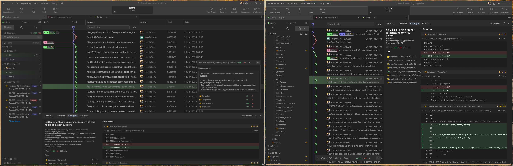

<div align="center">

  
  <h3><strong>G I T C H A</strong></h3>
  <sub><em>one app to gitcha all</em></sub>
  <br /><br />
  <a href="https://github.com/parazeeknova/gitcha/releases/latest"></a>
  
  
  
  
</div>

## download

pre-built binaries from the [latest release](https://github.com/parazeeknova/gitcha/releases/latest):

| platform | format | link |
|----------|--------|------|
| macOS (arm64) | `.dmg` | [gitcha_0.1.70_aarch64.dmg](https://github.com/parazeeknova/gitcha/releases/download/v0.1.70/gitcha_0.1.70_aarch64.dmg) |
| macOS (x64) | `.dmg` | [gitcha_0.1.70_x64.dmg](https://github.com/parazeeknova/gitcha/releases/download/v0.1.70/gitcha_0.1.70_x64.dmg) |
| linux | `.deb` | [gitcha_0.1.70_amd64.deb](https://github.com/parazeeknova/gitcha/releases/download/v0.1.70/gitcha_0.1.70_amd64.deb) |
| linux | `.AppImage` | [gitcha_0.1.70_x86_64.AppImage](https://github.com/parazeeknova/gitcha/releases/download/v0.1.70/gitcha_0.1.70_x86_64.AppImage) |
| linux | `.tar.gz` | [gitcha_0.1.70_x86_64.tar.gz](https://github.com/parazeeknova/gitcha/releases/download/v0.1.70/gitcha_0.1.70_x86_64.tar.gz) |
| linux | `PKGBUILD` | [PKGBUILD](https://github.com/parazeeknova/gitcha/releases/download/v0.1.70/PKGBUILD) |
| windows | `.exe` | [gitcha_0.1.70_x64-setup.exe](https://github.com/parazeeknova/gitcha/releases/download/v0.1.70/gitcha_0.1.70_x64-setup.exe) |
| windows | `.msi` | [gitcha_0.1.70_x64_en-US.msi](https://github.com/parazeeknova/gitcha/releases/download/v0.1.70/gitcha_0.1.70_x64_en-US.msi) |

## what is this ?

the git GUI that does what the paid ones do, but it's free, native, and local-first. commit graph, syntax-highlighted diffs, staging, drag-to-merge, embedded terminal, PR management, Actions monitoring, release browsing all in a single ~8MB rust binary. no electron, no subscription, no account, no cloud. your repos never leave your machine. gitcha just reads your `.gitconfig`, your ssh keys, your gpg config, and shows you everything git already knows.

## features

<div align="center" width="100%">

  

</div>

<br />

- **commit graph** — live DAG with color-coded branches, merge curves, clickable nodes
- **diff viewer** — syntax-highlighted, word-level inline diffs from libgit2
- **file tree** — working tree with git status badges and file-type icons
- **staging & commit** — stage files/hunks, amend, sign-off, skip hooks, stash mode
- **embedded terminal** — full shell via alacritty + PTY, right in the app
- **command palette** — Ctrl+K fuzzy search for every action
- **remote management** — fetch, pull, push, remotes, all in the same graph
- **drag-to-merge** — grab a branch, drop it, done
- **GitHub integration** — device flow OAuth, PRs, Actions, releases, packages in sidebar
- **PR management** — browse PRs, check status, view code diffs, linked to branches
- **Actions & CI** — pass/fail status per workflow, linked to triggering branch
- **releases & packages** — changelogs, assets, npm/container packages, version comparison
- **SQLite cache** — local snapshots, fingerprint-based invalidation, live refresh
- **multi-tab** — multiple repos, per-tab state, session persists across restarts
- **setup wizard** — detect git identity, SSH/GPG keys, optional GitHub sign-in

## requirements

**to run:** nothing. download the binary for your platform and it just works.

**to build from source:** [rustup](https://rustup.rs) with the latest stable toolchain (`rustup update stable`), plus:
- **linux:** git rust/rustup
- **macos:** Xcode command line tools
- **windows:** MSVC build tools or Visual Studio

## building from source

```bash
git clone https://github.com/parazeeknova/gitcha.git
cd gitcha
cargo build --release
# binary at target/release/gitcha
```

### arch linux

**pre-built binary** (from releases):

```bash
git clone https://github.com/parazeeknova/gitcha.git
cd gitcha
makepkg -si
```

or with make: `make pkg-install`

**build from source** (latest main):

```bash
git clone https://github.com/parazeeknova/gitcha.git
cd gitcha
makepkg -si -p PKGBUILD.git
```

or with make: `make pkg-git-install`

## development

```bash
make dev           # debug run
make run-release   # release run
make lint          # clippy + format check
make fmt           # auto-format
make test          # test suite
make build         # release build
```

## uninstall

**manual install:**

```bash
sudo make uninstall
```

**arch linux (makepkg):**

```bash
sudo pacman -R gitcha-bin    # pre-built
sudo pacman -R gitcha-git    # from source
```

**app data:** `~/.local/share/gitcha` — remove with `make clean-local`

## what's not here (yet)

no issue management, no interactive rebase (merge via drag-and-drop only), no inline PR commenting, no AI summarizer. it's growing, but it's still a local-first git tool — not a platform.

## contributing

open an issue if something is broken. open a pr if you fixed it. the codebase is intentionally small every module does one thing. if a pr makes a module do two things, we'll talk about it.

git is yours. your history is yours. every commit you ever made is sitting on your disk right now, complete and permanent, asking nothing from you. a tool that lets you see it, really see it, should be too.

that's gitcha. one app to gitcha all.


```text
⠀⠀⠀⠀⠀⠀⠀⠀⠀⠀⠀⠀⠀⠀⠀⠀⠀⠀⠀⠀⠀⠀⠀⠀
⠀⠀⠀⠀⠀⠀⣄⠀⠀⠀⣦⣤⣾⣿⠿⠛⣋⣥⣤⣀⠀⠀⠀⠀
⠀⠀⠀⠀⡤⡀⢈⢻⣬⣿⠟⢁⣤⣶⣿⣿⡿⠿⠿⠛⠛⢀⣄⠀
⠀⠀⢢⣘⣿⣿⣶⣿⣯⣤⣾⣿⣿⣿⠟⠁⠄⠀⣾⡇⣼⢻⣿⣾      gitcha by @parazeeknova
⣰⠞⠛⢉⣩⣿⣿⣿⣿⣿⣿⣿⣿⠋⣼⣧⣤⣴⠟⣠⣿⢰⣿⣿
⣶⡾⠿⠿⠿⢿⣿⣿⣿⣿⣿⣿⣿⣈⣩⣤⡶⠟⢛⣩⣴⣿⣿⡟      git already knows everything.
⣠⣄⠈⠀⣰⡦⠙⣿⣿⣿⣿⣿⣿⣿⣿⣿⣿⣿⣿⣟⡛⠛⠛⠁      gitcha just makes it visible.
⣉⠛⠛⠛⣁⡔⣿⣿⣿⣿⣿⣿⣿⣿⣿⣿⣿⣿⣿⣿⣿⠥⠀⠀      local, native, free.
⣭⣏⣭⣭⣥⣾⣿⣿⣿⣿⣿⣿⣿⣿⣿⣿⣿⣿⣿⣿⣿⣿⡿⢠⠀⠀⠀⠀⠀
```
— harsh / [@parazeeknova](https://przknv.cc)

<div align="center">
  <sub>MIT licensed · open source · free to use</sub>
  <br /><br />
  <sub>this project is possible due to <a href="https://itssingularity.com">Singularity Works</a></sub>
</div>
